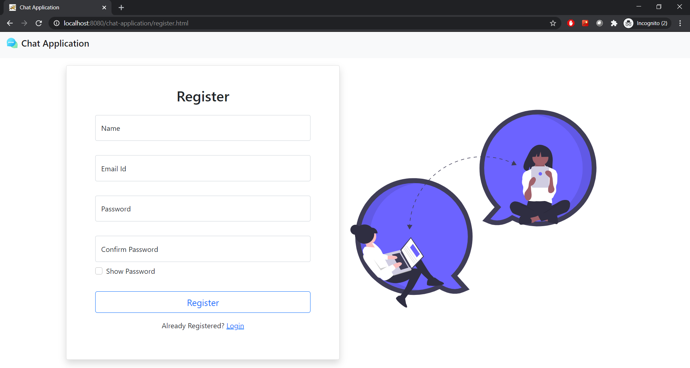

# Chat Application




> A simple web based chat application.

---

### Table of Contents

-   [Description](#description)
-   [How To Use](#how-to-use)
-   [Author Info](#author-info)

---

## Description

This is web based chatting application which would enable easy and user friendly communication.

#### Technologies

-   HTML5
-   Bootstrap5
-   JavaScript
-   Java
-   MySQl

[Back To The Top](#Chat-Application)

---

## How To Use

```
    > Clone the repo
        >> For Windows: Git Bash
        >> For Linux: Terminal
        >> git clone https://github.com/poddar-namita/chat-application.git
    > Install Apache Tomcat 9.0.
    > Navigate to C:\Program Files\Apache Software Foundation\Tomcat 9.0\webapps and clone the repo it this folder
    > Start Apache and MySQL in XAMMP.
    > Create Database.
    > Create a Database named "chat_application" and import the schema provided with the file name "chat_application.sql".
```

[Back To The Top](#Chat-Application)

---

## Author Info

-   LinkedIn - [@Namita Poddar](https://www.linkedin.com/in/namitapoddar/)
-   Gmail - poddarnamita.13@gmail.com

[Back To The Top](#Chat-Application)
